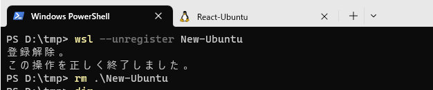

# 20230609_migrate-wsl2

## 概要
- WSL2を複製する

## 手順

### 01．移行元のOSイメージの保存
```
cd d:\tmp
wsl --shutdown
wsl -l -v
# wsl --export <VM NAME> <export tar file>
wsl --export wslUbuntu-22.04 d:\tmp\wslUbuntu-22.04.tar
```


### 02．保存イメージからOS複製
```
cd d:\tmp
wsl --shutdown
wsl -l -v
#
$env:NEWOS = "New-Ubuntu"
mkdir $env:NEWOS
wsl --import $env:NEWOS $env:NEWOS d:\tmp\wslUbuntu-22.04.tar
wsl -d $env:NEWOS
# VM のshellプロンプトへ移行
```

### 03．複製OSの設定
- VMのshellプロンプトから`/etc/wsl.conf`を編集してhostnameを変更
```sh
nano /etc/wsl.conf

... snip

# Network host settings that enable the DNS server used by WSL 2. This example changes the hostname, sets generateHosts>
[network]
# hostname = DemoHost
# generateHosts = false
# generateResolvConf = false
# hostname = wslUbuntu
hostname = newUbuntu

# 保存して[Ctrl+O -> Enter]、nanoを終了[Ctrl+X]
```

- 編集後、shellプロンプトを抜ける
```
logout
```

- WSLを再起動して、再度、VMにログイン
```
wsl --shutdown
wsl -l -v
$env:NEWOS = "New-Ubuntu"
wsl -d $env:NEWOS
```


## 参考手順

### 01．作成Vmイメージの削除方法
```
cd d:\tmp
wsl --shutdown
wsl -l -v
$env:NEWOS = "New-Ubuntu"
# wsl --export <VM NAME> <export tar file>
wsl --unregister $env:NEWOS
rm $env:NEWOS
```

#### 実行ログ

